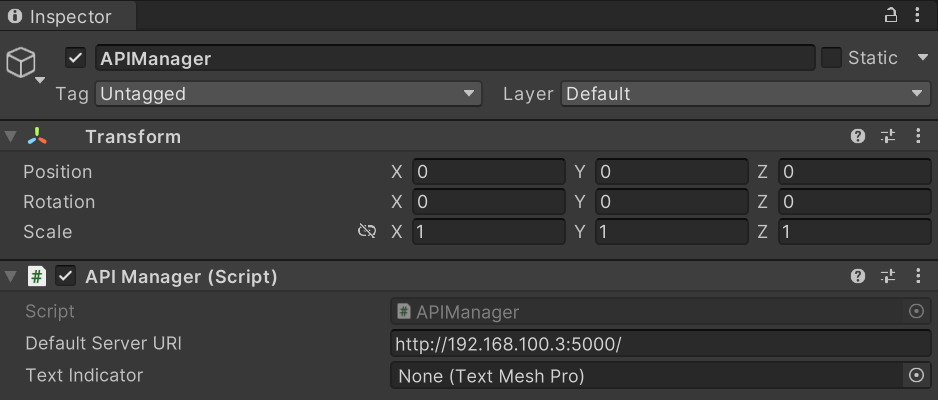

<!--
*** Thanks for checking out the Best-README-Template. If you have a suggestion
*** that would make this better, please fork the repo and create a pull request
*** or simply open an issue with the tag "enhancement".
*** Thanks again! Now go create something AMAZING! :D
-->


<!-- PROJECT SHIELDS -->
<!--
*** I'm using markdown "reference style" links for readability.
*** Reference links are enclosed in brackets [ ] instead of parentheses ( ).
*** See the bottom of this document for the declaration of the reference variables
*** for contributors-url, forks-url, etc. This is an optional, concise syntax you may use.
*** https://www.markdownguide.org/basic-syntax/#reference-style-links
-->
<!-- [![Contributors][contributors-shield]][contributors-url]
[![Forks][forks-shield]][forks-url]
[![Stargazers][stars-shield]][stars-url]
[![Issues][issues-shield]][issues-url] -->
[![MIT License][license-shield]][license-url]
<!-- [![LinkedIn][linkedin-shield]][linkedin-url] -->

# HoloLens2-ROS2 Interactions in Unity
Control your ROS2 Robot using interaction techniques via the HoloLens. This Unity project for the HoloLens contains different interaction techniques to control a ROS2 robot via APIs to the ROS2 Host Machine. 

<!-- PROJECT LOGO -->
<!-- <br />
<p align="center">
  <a href="https://github.com/othneildrew/Best-README-Template">
    
  </a>

  <h3 align="center">MRTK Custom Gestures in Unity</h3>

  <p align="center">
    Custom Gestures with Mixed Reality Toolkit!
    <br />
    <a href="https://github.com/othneildrew/Best-README-Template"><strong>Explore the docs »</strong></a>
    <br />
    <br />
    <a href="https://github.com/septianrazi/MRTK-Custom-Gestures-Unity">View Demo</a>
    ·
    <a href="https://github.com/septianrazi/MRTK-Custom-Gestures-Unity/issues">Report Bug</a>
    ·
    <a href="https://github.com/septianrazi/MRTK-Custom-Gestures-Unity/issues">Request Feature</a>
  </p>
</p> -->


<!-- TABLE OF CONTENTS -->
<details open="open">
  <summary>Table of Contents</summary>
  <ol>
    <li>
      <a href="#about-the-project">About The Project</a>
      <ul>
        <li><a href="#built-with">Built With</a></li>
      </ul>
    </li>
    <li>
      <a href="#getting-started">Getting Started</a>
      <ul>
        <li><a href="#prerequisites">Prerequisites</a></li>
        <li><a href="#use-in-your-own-projects">Use in your own Projects</a></li>
        <li><a href="#running-the-project">Running this Project</a></li>
      </ul>
    </li>
    <li><a href="#examples">Examples</a></li>
    <!-- <li><a href="#roadmap">Roadmap</a></li> -->
    <li><a href="#contributing">Contributing</a></li>
    <li><a href="#license">License</a></li>
    <li><a href="#contact">Contact</a></li>
    <li><a href="#acknowledgements">Acknowledgements</a></li>
  </ol>
</details>


<!-- ABOUT THE PROJECT -->
## About The Project

<!-- [![Product Name Screen Shot][product-screenshot]](https://example.com) -->

This Unity Project is part of the Larger [HoloLens2 ROS2 Interactions](https://github.com/septianrazi/HoloLens2-ROS2-Interactions) System. This repository is the Unity Project to be deployed to the HoloLens 2, exposing the interaction techniques of the device and, via an API call, triggering common robot movements in the ROS2 code.

This project is part of my final project for the Robotics and XR course of University of Eastern Finland in 2023.

### Interaction Techniques

Our HoloLens exposes the following interaction techniques to control the robot

#### Holographic Buttons

Traditional pressable buttons representing forward, backwards, left turn, right turn and stop.

#### Voice Commands

Voice commands in the HoloLens to robot movement. Default keywords include 'Forward', 'Backward', 'Left', 'Right', 'Stop'

#### Custom Hand Gestures

Custom hand gestures can trigger different robot movements. 

#### Holographic Hand Joy Con

Novel technique using both hands to control robot direction, akin to a large joystick

### Built With

* [Unity 2022.3.14f1](https://unity.com)
* [Microsoft Mixed Reality Toolkit 2.8.3](https://docs.microsoft.com/en-gb/windows/mixed-reality/mrtk-unity/)

<!-- GETTING STARTED -->
## Getting Started

### Prerequisites

You will need to download and install the following:
* [Unity](https://unity3d.com/get-unity/download)
* [Mixed Reality Toolkit for Unity](https://docs.microsoft.com/en-us/windows/mixed-reality/develop/install-the-tools?tabs=unity)

### Running the Project

1. Clone the repo
   ```sh
   git clone git@github.com:septianrazi/MRTK-Custom-Gestures-Unity.git
   ```
2. Open Project in Unity (2022 above recommended)
3. Change build target to Universal Windows Platform in Build Settings
4. Change the IP address in the API Manager object to the IP address of your ROS2 host machine. (We can change this after build via HoloLens 2 Device Manager) 
3. Build and Run the project to the HoloLens2 by following the [deploying to HoloLens from Unity instructions](https://learn.microsoft.com/en-us/windows/mixed-reality/develop/unity/build-and-deploy-to-hololens)

<!-- ### Changing the IP address on a HoloLens Build -->


<!-- USAGE EXAMPLES -->
<!-- ## Examples -->

<!-- Custom Gestures on the Hololens:


Custom Gestures on the Oculus:


Both examples above use three different hand gestures on either the right or left hand that will cause a sphere object to spawn and track to the users hand. The gestures include: THUMBS UP, FINGER GUN, SPIDERMAN, AND TWO. -->


<!-- ROADMAP -->
<!-- ## Roadmap

See the [open issues](https://github.com/othneildrew/Best-README-Template/issues) for a list of proposed features (and known issues). -->


<!-- CONTRIBUTING -->
## Contributing

Contributions are what make the open source community such an amazing place to be learn, inspire, and create. Any contributions you make are **greatly appreciated**.

1. Choose an Issue you want to work on and assign yourself

   If there is no exsiting issue, please submit one 

1. Fork the Project
2. Create your Feature Branch (`git checkout -b feature/AmazingFeature`)
3. Commit your Changes (`git commit -m 'Add some AmazingFeature'`)
4. Push to the Branch (`git push origin feature/AmazingFeature`)
5. Open a Pull Request linking the issue


<!-- LICENSE -->
## License

Distributed under the MIT License. See `LICENSE` for more information.


<!-- CONTACT -->
## Contact

Septian Razi - [septianrazi.github.io](septianrazi.github.io) - raziseptian@gmail.com

Project Link: [https://github.com/septianrazi/HoloLens2-ROS2-Interactions-Unity](https://github.com/septianrazi/HoloLens2-ROS2-Interactions-Unity)


<!-- ACKNOWLEDGEMENTS -->
## Acknowledgements
* [Valem](https://www.youtube.com/channel/UCPJlesN59MzHPPCp0Lg8sLw)
* [OthNeilDrew's README Template](https://github.com/othneildrew/Best-README-Template)
* [University of Eastern Finland Robotics and AI group](https://sites.uef.fi/edtech/research-labs-and-focus-groups/robotics-and-ai/)

<!-- 
* [Img Shields](https://shields.io)
* [Choose an Open Source License](https://choosealicense.com)
* [GitHub Pages](https://pages.github.com)
* [Animate.css](https://daneden.github.io/animate.css)
* [Loaders.css](https://connoratherton.com/loaders)
* [Slick Carousel](https://kenwheeler.github.io/slick)
* [Smooth Scroll](https://github.com/cferdinandi/smooth-scroll)
* [Sticky Kit](http://leafo.net/sticky-kit)
* [JVectorMap](http://jvectormap.com)
* [Font Awesome](https://fontawesome.com) -->


<!-- MARKDOWN LINKS & IMAGES -->
<!-- https://www.markdownguide.org/basic-syntax/#reference-style-links -->
[contributors-shield]: https://img.shields.io/github/contributors/othneildrew/Best-README-Template.svg?style=for-the-badge
[contributors-url]: https://github.com/othneildrew/Best-README-Template/graphs/contributors
[forks-shield]: https://img.shields.io/github/forks/othneildrew/Best-README-Template.svg?style=for-the-badge
[forks-url]: https://github.com/othneildrew/Best-README-Template/network/members
[stars-shield]: https://img.shields.io/github/stars/othneildrew/Best-README-Template.svg?style=for-the-badge
[stars-url]: https://github.com/othneildrew/Best-README-Template/stargazers
[issues-shield]: https://img.shields.io/github/issues/othneildrew/Best-README-Template.svg?style=for-the-badge
[issues-url]: https://github.com/othneildrew/Best-README-Template/issues
[license-shield]: https://img.shields.io/github/license/othneildrew/Best-README-Template.svg?style=for-the-badge
[license-url]: https://github.com/othneildrew/Best-README-Template/blob/master/LICENSE.txt
[linkedin-shield]: https://img.shields.io/badge/-LinkedIn-black.svg?style=for-the-badge&logo=linkedin&colorB=555
[linkedin-url]: https://linkedin.com/in/othneildrew
[product-screenshot]: images/screenshot.png